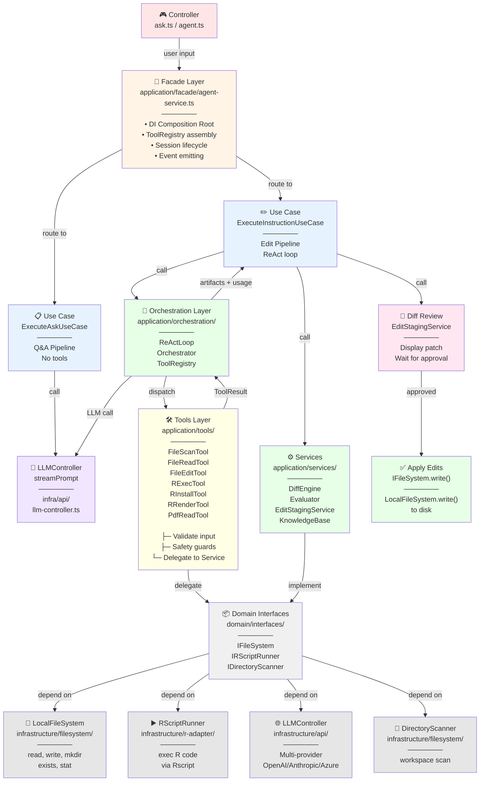
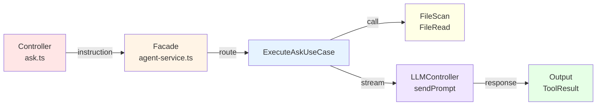
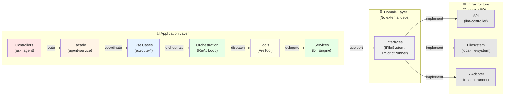

# Agent 調用路徑 - Mermaid 圖表

## 使用方式
1. 複製下面的 Mermaid 代碼
2. 在 draw.io 中：File → New → Diagram → 選 "Mermaid"
3. 貼上下面的代碼即可

---

## 完整調用流程圖



---

## 簡化版：Ask Pipeline (無 Tools)



---

## 簡化版：Instruction/Edit Pipeline (含 ReAct Loop)

```mermaid
graph TD
    A["Controller<br/>agent.ts<br/>user: edit this file"] -->|instruction| B["Facade<br/>agent-service.ts"]
    
    B -->|route| C["ExecuteInstructionUseCase"]
    
    C -->|orchestrate| D["Orchestrator<br/>ReActLoop<br/>—————<br/>Loop iteration"]
    
    D -->|prompt| E["LLMController<br/>sendPrompt"]
    
    E -->|[THOUGHT]<br/>[ACTION]| F{"Parse<br/>Markers"}
    
    F -->|[ACTION]| G["ToolRegistry<br/>execute<br/>—————<br/>• schema validation<br/>• error handling"]
    
    G -->|route| H["Tool<br/>file_read<br/>file_edit<br/>r_exec"]
    
    H -->|delegate| I["Service<br/>FileReadService<br/>DiffEngine<br/>RExecTool"]
    
    I -->|use| J["Domain Port<br/>IFileSystem<br/>IRScriptRunner"]
    
    J -->|implement| K["Infrastructure<br/>LocalFileSystem<br/>RScriptRunner<br/>Rscript exec"]
    
    K -->|[OBSERVATION]| D
    
    F -->|[ANSWER]| L["Extract<br/>Artifacts"]
    
    L -->|edits| M["EditStagingService<br/>DiffEngine review"]
    
    M -->|wait approval| N["User<br/>approval_callback"]
    
    N -->|approved| O["Apply<br/>IFileSystem.write"]
    
    O -->|disk| P["✅ Session saved"]
    
    style A fill:#FFE6E6
    style B fill:#FFF4E6
    style C fill:#E6F3FF
    style D fill:#E6FFE6
    style E fill:#F0E6FF
    style F fill:#FFFACD
    style G fill:#FFFFE6
    style H fill:#FFFFE6
    style I fill:#E6FFE6
    style J fill:#F0F0F0
    style K fill:#E6E6E6
    style L fill:#E6F3FF
    style M fill:#FFE6F0
    style N fill:#FFE6F0
    style O fill:#E6E6E6
    style P fill:#E6FFE6
```

---

## 層級對應表



---

## 在 Draw.io 中使用

### 步驟 1: 建立新的 Diagram
```
File → New → Diagram Type: Mermaid
```

### 步驟 2: 貼上 Mermaid 代碼
複製上面任一個 mermaid 區塊的代碼，貼入 draw.io 的編輯區

### 步驟 3: 自訂樣式
- 雙擊節點修改顏色、大小
- 調整箭頭標籤
- 重新排列佈局

### 導出
- 右上角 → Download → PNG / SVG / Draw format

---

## 快速索引

| 圖表 | 用途 |
|------|------|
| 完整調用流程圖 | 全面了解每個層級及其責任 |
| Ask Pipeline | 理解 Q&A 流程（無 tools） |
| Instruction Pipeline | 理解編輯流程（含 ReAct） |
| 層級對應表 | 快速查看依賴關係 |
