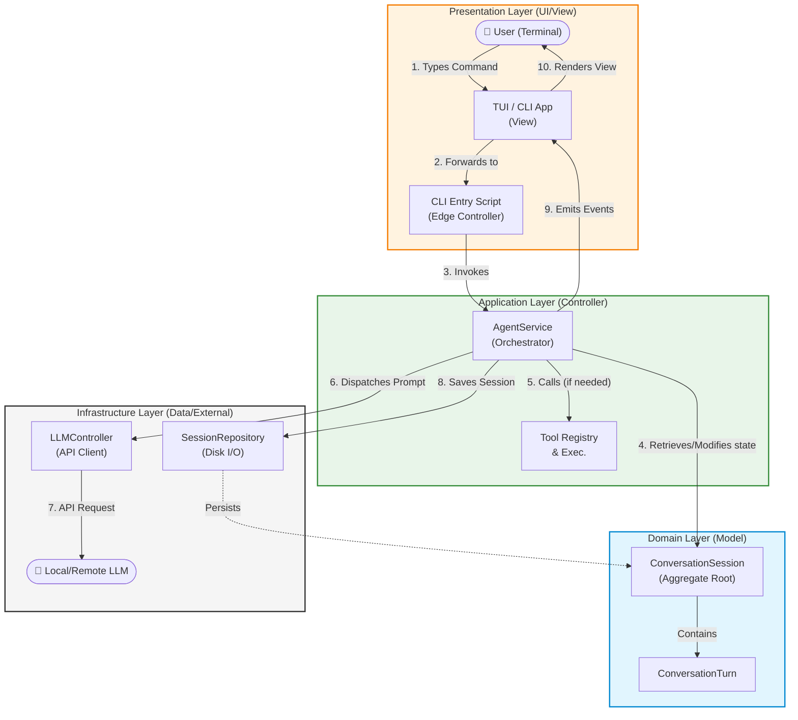

# CLI Agent Architecture Review

## 1. Flow Analysis: User ↔ CLI Agent ↔ Context/Conversation ↔ LLM

The current data flow can be mapped perfectly to both **MVC (Model-View-Controller)** and **DDD (Domain-Driven Design / Clean Architecture)** paradigms.

### Workflow Diagram

### A. User (The CLI Interaction)
* **MVC Mapping**: **View** & **Controller (Entry)**
  * The TUI (Terminal UI) acts as the **View**, displaying agent outputs, progress indicators, and colored diffs.
  * The initial CLI script (using Commander or similar) acts as the edge **Controller**, capturing user inputs (`instruction`).
* **DDD Mapping**: **Presentation Layer**
  * Located in `cli/src/presentation`. This layer is responsible for translating user console input into commands for the Application layer and formatting the system's output for human readability.

### B. CLI Agent (`AgentService`, `Orchestrator`, `Tools`)
* **MVC Mapping**: **Controller (Application Logic)**
  * The `AgentService` handles the business workflow: it receives the user's input, updates the Model (Context), triggers the LLM (External Service), and decides what to show the View.
* **DDD Mapping**: **Application Layer**
  * Located in `cli/src/application/services` (e.g., `agent-service.ts`, `orchestrator.ts`).
  * These are **Application Services**. They do not contain core business rules but orchestrate the execution flow (ReAct loop, intent classification, tool execution, safety gates/approvals). They depend on abstractions (ports) for external I/O.

### C. Context / Conversation (`ConversationSession`, `ConversationTurn`)
* **MVC Mapping**: **Model**
  * Holds the state of the conversation, the token budget, the history of messages, and the applied artifacts. It encapsulates the data and the rules governing it (e.g., tracking token health).
* **DDD Mapping**: **Domain Layer**
  * Located in `cli/src/domain/entities` (e.g., `conversation-session.ts`, `conversation-turn.ts`).
  * `ConversationSession` is an **Aggregate Root**. It ensures the integrity of the conversation state (e.g., managing the token budget, handling rollbacks, adding turns). 

### D. LLM (`LLMController`, `HistorySummarizer`, `SessionRepository`)
* **MVC Mapping**: **Data Access / External Service**
  * Abstracted away so the Controller just asks for completions. Persistence handles saving the Model state to disk.
* **DDD Mapping**: **Infrastructure Layer**
  * Located in `cli/src/infrastructure` (API clients like `llm-controller.ts`, persistence like `session-repository.ts`).
  * These adapters implement the technical details of connecting to OpenAI/Anthropic/Ollama and saving the session state to the file system.

---

## 2. Is the Architecture "Good Enough"?

**Yes, the architecture is excellent and robust.** 

### Strengths:
1. **Clean Separation of Concerns**: By splitting into `presentation`, `application`, `domain`, and `infrastructure`, you have achieved excellent modularity. `AgentService` is completely headless and unaware of the CLI, making it highly testable and reusable (e.g., it could easily be attached to a WebSocket backend or a Discord bot).
2. **Dependency Inversion**: `AgentService` accepts its dependencies (`LLMController`, `SessionRepository`, `DiffEngine`) via injection (`AgentServiceDeps`). This is a hallmark of good Clean Architecture, making unit testing straightforward.
3. **Rich Domain Model**: Instead of just using raw arrays of messages, you've wrapped the state in a `ConversationSession` entity that actively manages token budgets (health tracking) and rollback capabilities. This prevents the "anemic domain model" anti-pattern.
4. **Resilience**: The `HistorySummarizer` acts as a great middleware pattern to compress context when the token budget nears its limits, preventing hard API crashes.

### Suggestions for Improvement (The "Next Level"):
1. **Interfaces for Ports**: While Dependency Injection is present, ensure you are injecting *Interfaces* (e.g., `ILLMController`, `ISessionRepository`) rather than concrete classes. This adheres strictly to the Dependency Inversion Principle (DIP) and ensures the Application layer knows nothing about the Infrastructure implementation.
2. **Event Sourcing Considerations**: Currently, `AgentService` emits events (`AgentEvent`). Because the agent is highly stateful, you might consider formalizing these events into an Event Bus or using an RxJS stream if the event complexity grows, making it easier for the TUI to react statelessly.
3. **Tool Registry Abstraction**: `ToolRegistry` could be decoupled into a proper Plugin/Adapter pattern where the `AgentService` only knows about an `ITool` interface, allowing third-party tools to be loaded dynamically without modifying the core agent logic.
