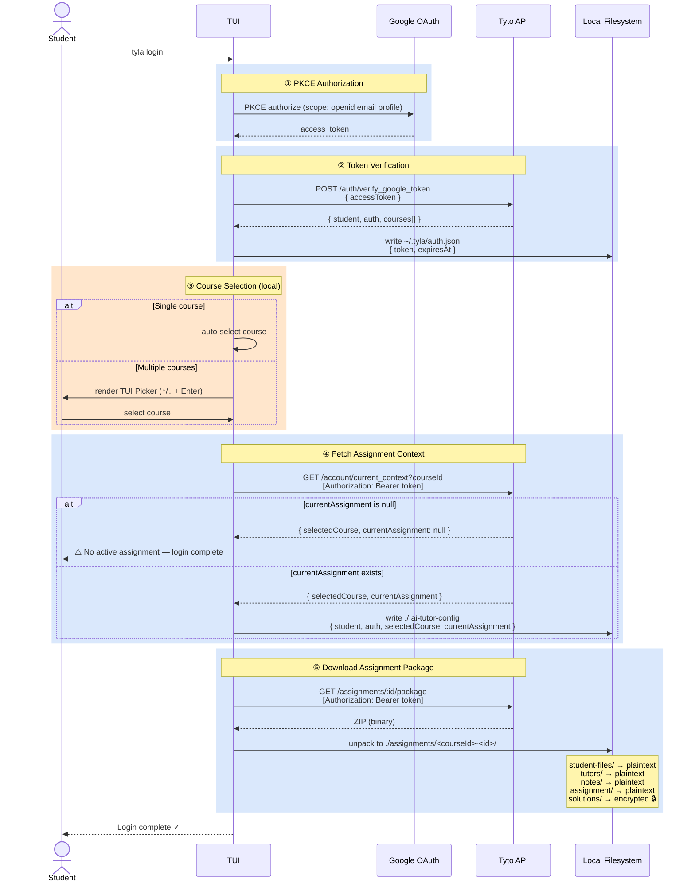
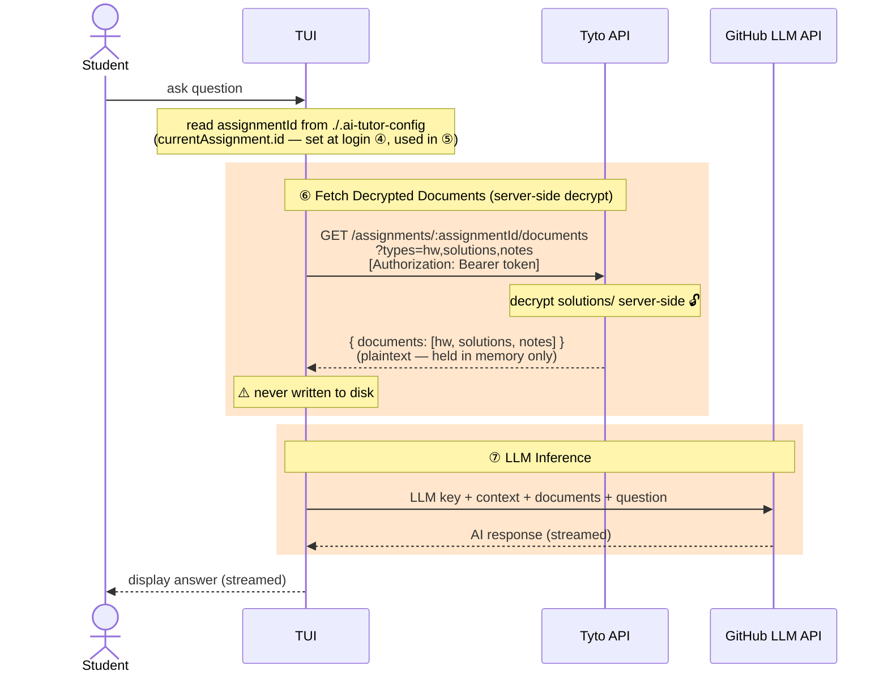
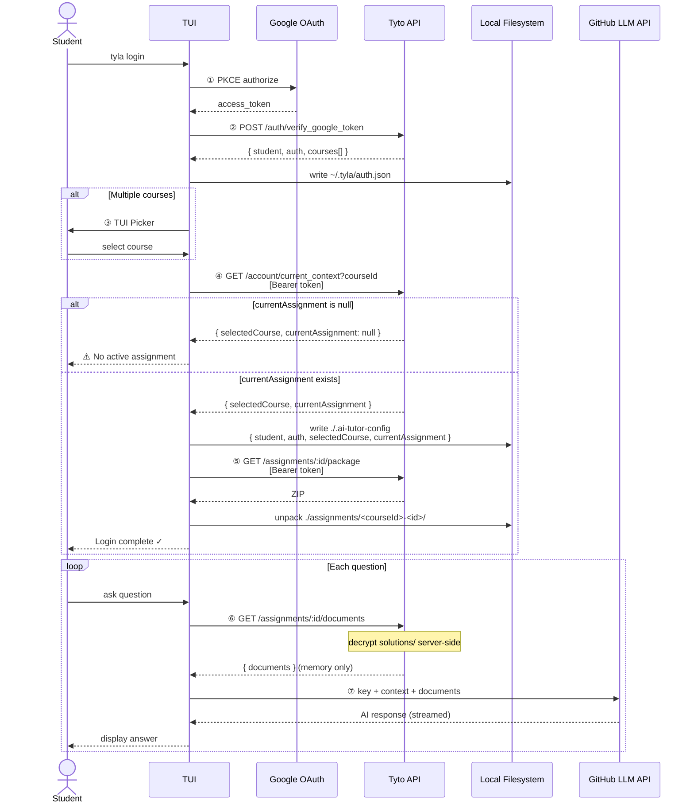

# Tyla CLI — Data Flow Sequence Diagram

> **Version:** 1.0  
> **Date:** 2026-05-12

---

## Login Flow

---

## Question Flow

> Corresponds to **Section 4** of the API spec: `GET /assignments/:assignmentId/documents`

---

## Combined Overview

