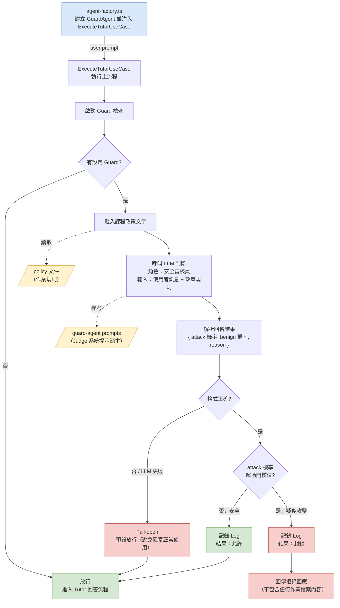

```mermaid
flowchart TD
    FACTORY["agent-factory.ts\n建立 GuardAgent 並注入 ExecuteTutorUseCase"]

    FACTORY -->|user prompt| EXECUTE["ExecuteTutorUseCase\n執行主流程"]

    EXECUTE --> RUN_GUARD["啟動 Guard 檢查"]

    RUN_GUARD --> HAS_GUARD{有設定 Guard?}
    HAS_GUARD -->|否| PASS["放行\n進入 Tutor 回答流程"]

    HAS_GUARD -->|是| LOAD["載入課程政策文字"]
    LOAD -.->|讀取| POLICY[/"policy 文件\n（作業規則）"/]

    LOAD --> LLM_CALL["呼叫 LLM 判斷\n角色：安全審核員\n輸入：使用者訊息 + 政策規則"]
    LLM_CALL -.->|參考| PROMPT_FILE[/"guard-agent prompts\n（Judge 系統提示範本）"/]

    LLM_CALL --> PARSE["解析回傳結果\n{ attack 機率, benign 機率, reason }"]

    PARSE --> VALID{格式正確?}
    VALID -->|否 / LLM 失敗| FAILOPEN["Fail-open\n預設放行（避免阻塞正常使用）"]
    FAILOPEN --> PASS

    VALID -->|是| THRESHOLD{"attack 機率\n超過門檻值?"}

    THRESHOLD -->|否，安全| LOG_OK["記錄 Log\n結果：允許"]
    LOG_OK --> PASS

    THRESHOLD -->|是，疑似攻擊| LOG_BLOCK["記錄 Log\n結果：封鎖"]
    LOG_BLOCK --> REFUSE["回傳拒絕回應\n（不包含任何作業檔案內容）"]

    style FACTORY fill:#dae8fc,stroke:#6c8ebf
    style POLICY fill:#fff2cc,stroke:#d6b656
    style PROMPT_FILE fill:#fff2cc,stroke:#d6b656
    style FAILOPEN fill:#f8cecc,stroke:#b85450
    style LOG_BLOCK fill:#f8cecc,stroke:#b85450
    style REFUSE fill:#f8cecc,stroke:#b85450
    style PASS fill:#d5e8d4,stroke:#82b366
    style LOG_OK fill:#d5e8d4,stroke:#82b366
```
