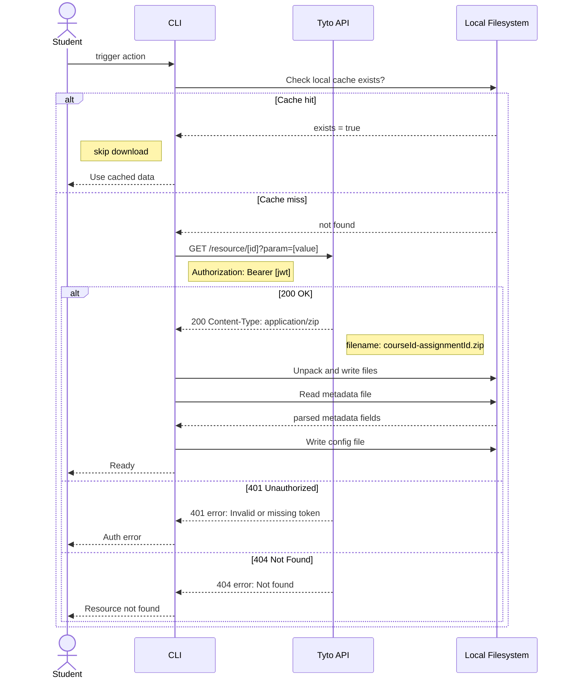
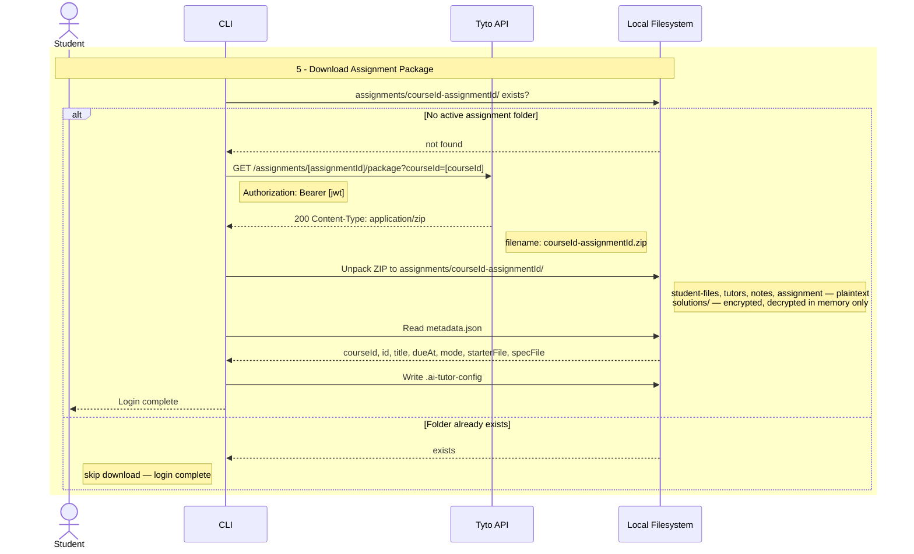

# Skill: 繪製 Mermaid 循序圖（Sequence Diagram）

## 目的

從 API spec 文件萃取流程，產生可正確渲染的 Mermaid 循序圖，避免常見 parse error，並與現有 drawio 風格保持一致。

---

## 步驟

1. **確認是否有現有 drawio/圖片**：先看 `plans/img/` 有無對應流程圖，對齊參與者名稱與風格。
2. **閱讀 spec**：找出 endpoint 的 request headers、response、error cases、本地副作用（檔案讀寫）。
3. **列出參與者**：依 drawio 命名，例如 `Student`、`CLI`、`Tyto API`、`Local Filesystem`。
4. **畫出主流程**：request → response → 本地 I/O。
5. **決定是否顯示 error cases**：若對齊 drawio 風格，保持主線清晰，可省略 4xx。
6. **套用安全字元規則**（見下方）。

---

## 常見 Parse Error 與修正對照表

| 錯誤寫法 | 會發生的問題 | 安全寫法 |
|---|---|---|
| `<courseId>-<assignmentId>` | `<` `>` 被當作 HTML tag，parse 失敗 | `courseId-assignmentId` 或 `[courseId]-[assignmentId]` |
| `Bearer <token>` | 同上 | `Bearer [jwt]` |
| `filename="CS201-HW2.zip"` 在 Note 內 | 雙引號 `"` 被當作字串邊界，截斷後面內容 | 移除引號：`filename: CS201-HW2.zip` |
| Note 內含多個冒號，如 `Content-Disposition: attachment; filename="..."` | 引號加冒號組合觸發 parse error | 拆成簡短描述，不含引號 |
| `<br>` 在 Note 內（某些版本） | 部分 renderer 不支援 | 改用 `<br/>` 或拆為多個 Note |
| 圓圈數字 `①②③` 在標題內 | 部分 renderer 無法渲染 Unicode 符號 | 改用 `1 -`、`2 -` 純文字前綴 |

### 核心規則

- **`Note` 區塊內禁用雙引號 `"`** — 這是最常見的 parse error 來源。
- **標籤文字禁用 `<` `>`** — 用 `[param]` 或純文字取代。
- **每個 `Note` 只放一層資訊**，避免過長或含特殊符號的複合字串。

---

## 對齊 drawio 風格

當專案已有 drawio 流程圖（如 `plans/img/Login Flow.drawio.png`）時，Mermaid 應對齊其視覺風格：

| 風格項目 | drawio | Mermaid 對應做法 |
|---|---|---|
| 參與者名稱 | Student, CLI, Tyto API, Local Filesystem | 直接對齊，不自行改名 |
| 階段分組 | 黃底圓角框 + 圓圈數字標題 | `rect rgb(255,255,204)` + `Note over` 全寬標題 |
| 條件標注 | 左側小字說明 | `Note left of [participant]` |
| Error cases | 主線圖不顯示 4xx | 省略，保持主線清晰 |

### 階段框語法

```
rect rgb(255, 255, 204)
    Note over Student,FS: 5 - Download Assignment Package
    ...
end
```

- `rect` 的顏色用 `rgb(255,255,204)` 近似 drawio 黃色。
- `Note over A,B` 跨越所有參與者，製造標題列效果。
- 圓圈數字改為 `5 -` 純文字（避免 Unicode parse 問題）。

---

## 範本 A：含 error cases（完整版）



## 範本 B：對齊 drawio 風格（主線版）



---

## 調試技巧

- **看 parse error 的行號**：Mermaid 通常會指出第幾行，直接找那行的引號或角括號。
- **縮小範圍**：把 `alt` 區塊或 `Note` 一段段移除，找到真正觸發 error 的那行。
- **測試工具**：[Mermaid Live Editor](https://mermaid.live) 可即時預覽並顯示詳細錯誤訊息。

---

## 來源

本 skill 整理自 2026-05-16 針對 `GET /assignments/:assignmentId/package?courseId=:courseId` 繪製循序圖的實作經驗，並根據 `plans/img/Login Flow.drawio.png` 風格對齊調整。
